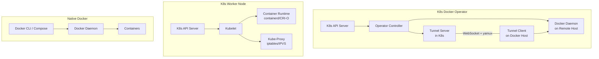
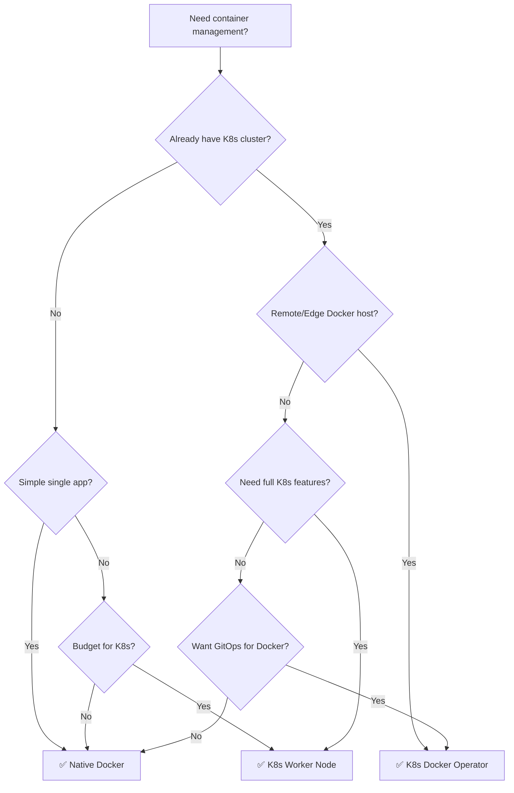

# Container Management: K8s Docker Operator vs K8s Worker vs Native Docker

## Architecture Overview

---

## Feature Comparison

| Feature | Native Docker | K8s Docker Operator | K8s Worker Node |
|:---|:---:|:---:|:---:|
| **Setup Complexity** | ⭐ Very Low | ⭐⭐ Medium | ⭐⭐⭐ High |
| **Cost** | $ Cheapest | $$ Low | $$$ Highest |
| **Learning Curve** | Low | Medium (K8s CRDs) | High (Full K8s) |

### Container Lifecycle

| Capability | Native Docker | K8s Docker Operator | K8s Worker Node |
|:---|:---:|:---:|:---:|
| Create/Start/Stop | ✅ `docker run` | ✅ CRD → Reconciler | ✅ Pod Spec |
| Restart Policy | ✅ `--restart` | ✅ `restartPolicy` field | ✅ Pod `restartPolicy` |
| Rolling Updates | ❌ Manual | ⚠️ Recreate only | ✅ Deployment strategy |
| Multi-container Pod | ❌ N/A | ⚠️ Separate CRs | ✅ Native sidecar support |
| Init Containers | ❌ N/A | ❌ Not supported | ✅ Native |
| **Job / One-off Tasks** | ⚠️ `docker run` (manual) | ✅ **DockerJob CRD** | ✅ Kubernetes Job |

### Health & Self-Healing

| Capability | Native Docker | K8s Docker Operator | K8s Worker Node |
|:---|:---:|:---:|:---:|
| Health Checks | ✅ `HEALTHCHECK` in Dockerfile | ✅ **CRD `healthCheck`** → Docker healthcheck | ✅ Liveness/Readiness/Startup probes |
| Auto-Restart on Failure | ✅ Via restart policy | ✅ Reconciler detects & restarts | ✅ Kubelet restarts |
| Health Status Reporting | ⚠️ `docker inspect` only | ✅ **CR `.status.health`** | ✅ Pod conditions + events |
| Readiness Gating | ❌ | ❌ | ✅ Traffic removed from Service |

### Configuration & Drift

| Capability | Native Docker | K8s Docker Operator | K8s Worker Node |
|:---|:---:|:---:|:---:|
| Declarative Config | ⚠️ Compose file (not reconciled) | ✅ CRD (reconciled every 1min) | ✅ Pod Spec (instant reconcile) |
| Drift Detection | ❌ None | ✅ **Image, Cmd, Env, RestartPolicy** | ✅ Full spec sync |
| GitOps Compatible | ⚠️ Via scripts | ✅ ArgoCD / Flux | ✅ ArgoCD / Flux |
| Config/Secrets | ⚠️ `.env` files, Docker secrets | ✅ K8s Secrets (env + volume mount) | ✅ ConfigMap + Secret |

### Networking

| Capability | Native Docker | K8s Docker Operator | K8s Worker Node |
|:---|:---:|:---:|:---:|
| Container-to-Container | ✅ Docker network | ⚠️ Same Docker host only | ✅ Pod localhost / CNI |
| Service Discovery | ❌ Manual / DNS | ✅ **K8s Service via Tunnel** | ✅ ClusterIP / DNS |
| Load Balancing | ❌ External only | ⚠️ Single tunnel, no LB | ✅ kube-proxy / IPVS |
| Network Policy | ❌ | ❌ | ✅ NetworkPolicy (Calico, Cilium) |
| Ingress / Gateway | ❌ Reverse proxy manual | ⚠️ Tunnel Gateway (NodePort 30000) | ✅ Ingress Controller |

### Security

| Capability | Native Docker | K8s Docker Operator | K8s Worker Node |
|:---|:---:|:---:|:---:|
| Auth/AuthZ | ⚠️ Docker socket access | ✅ **Tunnel Token Auth** + K8s RBAC | ✅ RBAC, PSP/PSA |
| Secrets Management | ⚠️ Docker secrets / `.env` | ✅ K8s Secrets (SecretKeyRef) | ✅ K8s Secrets + CSI |
| Network Encryption | ❌ | ⚠️ Token over WebSocket (no TLS by default) | ✅ mTLS (service mesh) |
| Container Isolation | ⚠️ Root by default | ⚠️ Root Docker socket required | ✅ Rootless, Seccomp, AppArmor |
| Multi-tenancy | ❌ | ⚠️ K8s Namespaces (CRD level) | ✅ Full namespace isolation |

### Scaling & Scheduling

| Capability | Native Docker | K8s Docker Operator | K8s Worker Node |
|:---|:---:|:---:|:---:|
| Horizontal Scaling | ❌ Manual | ⚠️ Multiple CRs manually | ✅ HPA / KEDA |
| Resource Limits | ✅ `--cpus`, `--memory` | ❌ Not implemented yet | ✅ Requests / Limits |
| Scheduling | ❌ Manual placement | ⚠️ Manual `DockerHostRef` | ✅ Scheduler (affinity, taints) |
| Node Auto-scaling | ❌ | ❌ | ✅ Cluster Autoscaler |

### Observability

| Capability | Native Docker | K8s Docker Operator | K8s Worker Node |
|:---|:---:|:---:|:---:|
| Logs | ✅ `docker logs` | ⚠️ `docker logs` on host | ✅ `kubectl logs` + aggregation |
| Metrics | ⚠️ `docker stats` | ⚠️ Docker API only | ✅ Prometheus / metrics-server |
| Events | ❌ | ⚠️ K8s events (limited) | ✅ Full K8s events |
| Tracing | ❌ | ❌ | ✅ OpenTelemetry |

---

## Cost Comparison (Typical Single-App Scenario)

| | Native Docker | K8s Docker Operator | K8s Worker Node |
|:---|:---:|:---:|:---:|
| **Min Resources** | 1 VM (1 CPU, 1GB) | 1 K8s cluster + 1 VM | 1 K8s cluster + 1 Node |
| **Estimated Monthly** | ~$5-10 | ~$20-40 (cluster shared) | ~$50-100+ |
| **Ops Overhead** | Low (SSH + scripts) | Medium (K8s + Operator) | High (Full K8s ops) |

---

## Decision Matrix

---

## When to Use Each

### ✅ Native Docker
- Simple single-service deployments
- Local development environments
- Budget-constrained projects with no K8s
- Quick prototyping

### ✅ K8s Docker Operator
- **Edge/IoT devices** too lightweight for Kubelet
- Connecting **legacy Docker VMs** to existing K8s cluster
- **GitOps-driven Docker management** without full node join
- Dev/staging where K8s control plane exists but extra nodes cost too much
- **Hybrid architecture**: K8s apps + external Docker services unified under one API

### ✅ K8s Worker Node
- Production microservices at scale
- Multi-tenant clusters
- Workloads requiring **service mesh, HPA, PVC, NetworkPolicy**
- Compliance-heavy environments (RBAC, audit, pod security)
- When you need **full ecosystem** (Prometheus, Istio, ArgoCD, etc.)

---

## Summary Score Card

| Dimension | Native Docker | K8s Docker Operator | K8s Worker |
|:---|:---:|:---:|:---:|
| Simplicity | ⭐⭐⭐⭐⭐ | ⭐⭐⭐ | ⭐⭐ |
| Cost Efficiency | ⭐⭐⭐⭐⭐ | ⭐⭐⭐⭐ | ⭐⭐ |
| Self-Healing | ⭐⭐ | ⭐⭐⭐⭐ | ⭐⭐⭐⭐⭐ |
| Security | ⭐⭐ | ⭐⭐⭐ | ⭐⭐⭐⭐⭐ |
| Networking | ⭐⭐ | ⭐⭐⭐ | ⭐⭐⭐⭐⭐ |
| Scalability | ⭐ | ⭐⭐ | ⭐⭐⭐⭐⭐ |
| Observability | ⭐⭐ | ⭐⭐⭐ | ⭐⭐⭐⭐⭐ |
| GitOps Ready | ⭐ | ⭐⭐⭐⭐ | ⭐⭐⭐⭐⭐ |
| **Overall** | **6/10** | **7.5/10** | **9.5/10** |

> [!TIP]
> The k8s-docker-operator fills a unique niche: **K8s-level declarative management for Docker containers that can't or shouldn't join the cluster as full nodes.** After P0 improvements, it closes the gap on health checks, drift detection, and tunnel security — making it production-viable for its target use cases.
